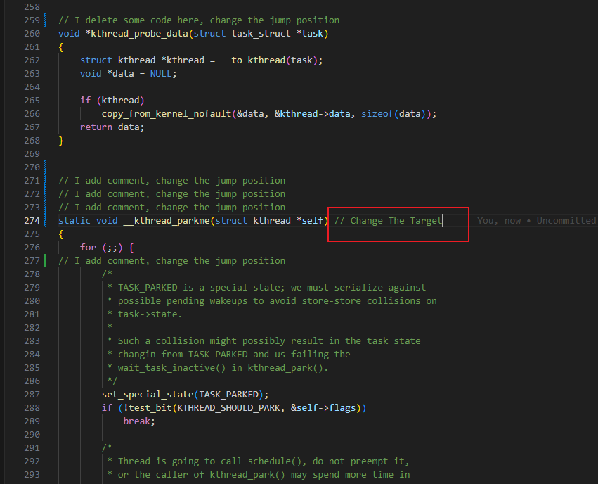
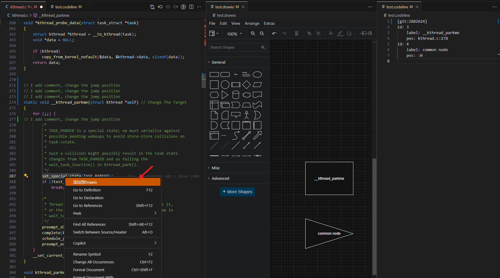
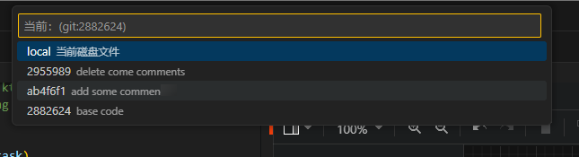

# flowcode-vscode-drawio

## 简介

vscode内drawio流程图绘制+代码跳转工具，由[vscode-drawio](https://github.com/hediet/vscode-drawio)修改。

> vscode-drawio是一个可用于在vscode中绘制drawio流程图的插件，然而该插件的代码跳转功能较弱且并不支持所有语言。本项目旨在对其作出改进，实现更为强大的代码跳转功能，改善平时梳理项目结构的效率。
>
> 原版vscode-drawio通过识别代码中的符号实现定位，如可以通过在drawio页面添加一个`#MyClass`节点的方式快速跳转到编辑器中名字为`MyClass`的类。这种定位方式的缺陷在于无法支持全部语言，同时对于复杂项目也无法准确定位（而平时我们梳理简单的项目结构又不需要流程图辅助，因此总感觉原版的代码跳转功能比较鸡肋）。
>
> 本项目基于行号信息实现跳转，因此会创建一个与drawio文件同名的`.codeline`文件，记录跳转信息。这样就可以实现对任何语言的支持，同时也可以准确定位到代码位置。

觉得看文字教程麻烦可以直接看[视频](https://www.bilibili.com/video/BV1nkNEeREPy/?share_source=copy_web&vd_source=eac08133647d78cc7cb08d38024860b4)，实际上手很快，基本只需要跟着直觉操作。

目前还未发布插件市场，提供demo版本，请自行从release页面下载vsix文件安装。后续代码进一步优化后将开源并发布到插件市场（随缘，我也不知道要多久）。

插件安装方法：

1. 本地安装：Extensions视图中点击“...”->“Install from VSIX...”->选择下载的vsix文件
2. 远控环境中安装：在远控环境中执行`code --install-extension xxx.vsix`命令

如果你安装了原版的vscode-drawio，安装后会替代原版的vscode-drawio。

## 使用建议

codeline文件与drawio文件的缓存相同步，在关闭vscode前记得保存drawio文件。

建议将drawio编辑器组锁定（文件右上角三个点->Lock Group），不然跳转时新打开文件时会占用drawio编辑器区域。

## 基础功能介绍

以下介绍内容均为vscode-drawio中未实现的功能。

### 添加节点

在编辑器中选择任何文本并单击右键，就可以在.drawio 文件中快速添加以该文本作为标签的节点。

与此同时，相应的代码位置将记录在同名的 .codeline 文件中。

通过drawio UI创建的节点不会产生代码跳转信息，但是用户可以直接编辑codeline文件添加跳转信息。

### 跳转代码

使用上述方法添加的节点具有跳转功能。在 Draw.io UI 中，按住 Ctrl + 单击节点可让用户直接跳转到对应代码。

### 编辑标签

编辑drawio UI中的节点标签，.codeline 中的信息将同时更改

### 删除节点

删除节点时，.codeline 文件中的相应信息将被注释掉，而不是直接删除。这是为了准备用户可能的撤销操作。

### 撤销和重做

在上述所有操作中，我都考虑了撤消和重做操作。撤销或重做操作中产生的任何节点删除、重新添加或标签修改都将与 .codeline 文件同步。

### 跳转到codeline文件

使用 Shift + Ctrl + 单击节点，可以快速跳转到codeline文件中查看所选节点的代码跳转信息。

这个功能一般用于给原先没有跳转功能的节点添加跳转信息。会在codeline文件中创建一个信息模板，方便用户手动添加跳转位置的详细信息。

### 精简codeline文件

使用 File -> Simplify，可以删除现有节点的所有无效数据（如注释），从而简化当前的codeline文件。

### 备份codeline文件

使用 File -> Backup，可以备份将当前codeline文件。

## 高级功能介绍

这部分介绍会涉及到一部分原理上的解释，如果嫌麻烦可以跳到最后一章直接看总结。默认大家都会一定的git操作。

使用行号进行导航的挑战在于，修改源代码会导致跳转信息被修改。为了解决这个问题，我利用 Git 来确保位置跟踪的准确性。这意味着，如果用户需要修改原始代码，就必须首先在 Git 仓库中跟踪相应的源文件。

保证你的源代码在git仓库中

使用 "File->Change CodeLine Commit" 并选择一个CommitID，你会看到 .codeline 的第一行变成 [git:commitID]。这意味着代码行文件中的行号信息与该commit中的代码状态相对应。相比之下，之前的[local]代表的是绝对跳转，在这种定位下会直接根据codeline文件中记录的行号进行跳转。

### git模式下的代码跳转

使用 Ctrl + Click节点 ，会根据 git diff 计算出当前本地文件的正确行号，因此即使源代码已被修改，也能确保准确跳转。

即使目标行被一定程度上修改，也能找到（我是通过最短编辑路径来推算的可能性最大的行号，因此只要目标行不被改的太严重都能导航到）。

即使目标位置被剪切并移动到该文件的其他位置，仍可对其进行一定程度的精确跟踪（原理和上面类似）。

### git模式下添加节点

git模式下不太建议手动编辑codeline信息，因为你需要知道的当前行在指定commitID下的行号。建议通过右键菜单的方式添加。

例如，在当前文件的第 287 行添加一个节点，会导致在codeline文件出现一个290行的新跳转条目。这是因为在当前文件第 287 行的内容在指定commitID中实际位于第290行。

### 修改commitID

您可以在不同的commit ID 之间自由切换。当设置为[local]时，codeline位置信息将直接反映存储在磁盘上文件的当前行号。

对于熟悉 Git 操作的用户来说，掌握了上述功能，即使在执行版本回滚或对代码进行其他修改时，也能保留大部分跳转信息。

## 总结

这种代码导航方法比原版插件的方法更灵活、更有效（尤其适用于大型项目的结构梳理），但它引入了一些额外的操作：

- 如果不修改代码，则无需额外步骤，只需保持[local]模式即可。
- 如果修改只涉及添加注释，只需在注意编辑前切换到 Git 模式，选择最新的commitID 即可。之后就正常使用无需再做其他操作了。
- 如果代码需要频繁地修改或回滚 git commit，用户就需要对插件工作原理有一定了解，记得适时切换 .codeline 文件中的 commitID。过多的改动难免导致部分跳转信息失真，这种情况下可能需要手动编辑 .codeline 文件。

此外，这种方法还引入了一个新的codeline文件，该文件会保存在你的本地（这不太优美，但管他呢，反正我用的爽这样方便我直接编辑）。

其他注意事项：
- 尽量不要让跳转的目标行为空行，或者目标行字符很少（因为git模式下的目标行位置推算是通过最短编辑距离实现的）
- 修改源代码的文件名会导致相关的跳转信息失效，需手动调整codeline文件（git本身局限，无法完美追踪到文件名修改，因此目前没做实现）
- 注意适时保存drawio文件
- 环境中需要有git命令，可以通过setting中`FlowCode: Git Path`指定使用的git命令路径
- 当前demo版本仅支持git仓库直接位于vscode当前打开的工作区根目录下
- 使用ctrl x/c + ctrl v创建的节点不能继承原节点的跳转信息

常见问题：
- 报错显示没有选中drawio文件
  - 打开vscode后需要先选择一个drawio文件，点击其中画板部分才能选择成功
- git模式下ctrl+单击跳转时显示未找到定位信息
  - 首先ctrl+shift+单击查看下codeline文件中是否确实存在定位信息
  - 其次检查下定位信息中的文件路径是否正确
  - 最后检查下该文件是否确实加入工作区根目录的Git跟踪（可通过`git log -- filepath`确认），有时候文件可能被ignore没有加进仓库中，也可能存放在了子文件夹的git仓库中
- 切换commitID时有些跳转信息消失了
  - 消失是因为无法推理得到新commitID下的行号，可以检查下该commitID下该文件是否被git跟踪
  - 执行切换commitID操作时会自动备份一次clodeline文件，如果发现跳转信息都没了，用备份文件恢复下

## 后续计划

随缘进一步优化代码并发布市场，反正本来也是给自己用用爽爽，到了自己能用的程度就懒得动了qaq。

如果有~~帕鲁~~开发者想一同参与优化，可以联系我。我也希望最终能作为vscode-drawio的扩展插件发布到市场，而不是像现在一样安装后直接替换原版vscode-drawio，所以目前不太敢发布（

遇到bug欢迎提。